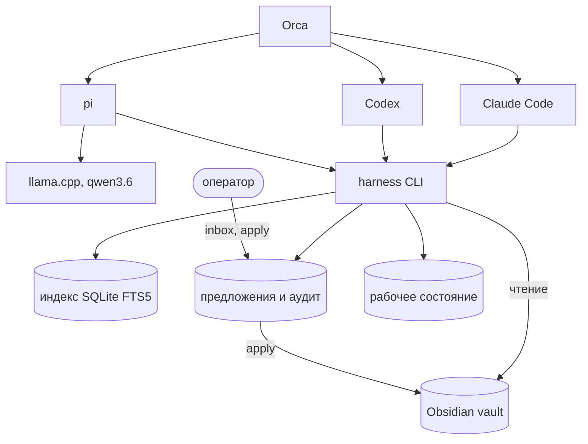
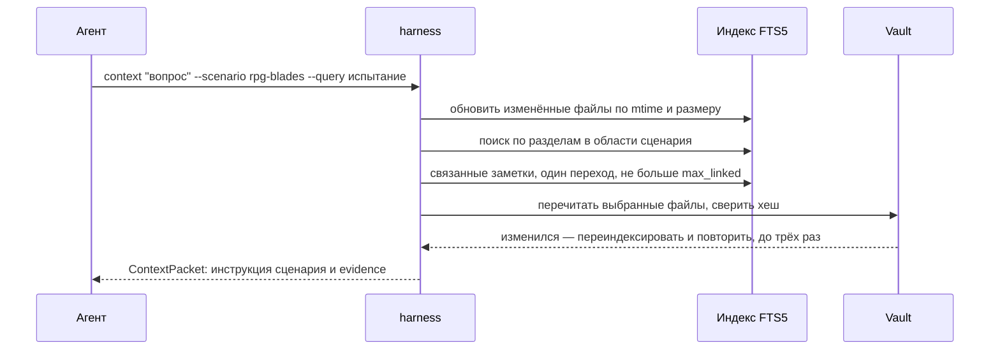
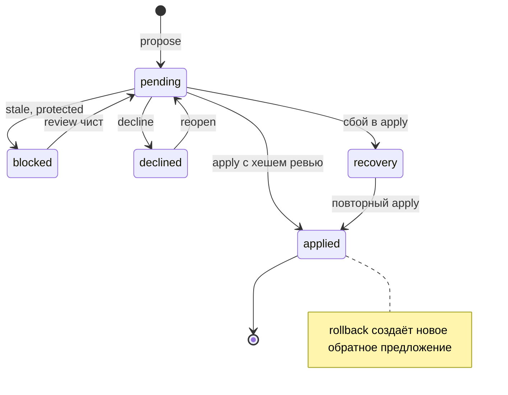
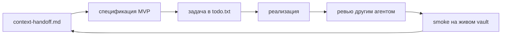

У меня большой vault в Obsidian: правила и лор настольных игр, проекты
разработки, конспекты книг, статьи, личная wiki. И три агентных runtime:
Claude Code, Codex и pi, который гоняет qwen3.6 через llama.cpp на домашней
видеокарте. Запуском и передачей задач между ними управляет
Orca.

До harness каждый агент ходил в vault по-своему. Для pi я написал скиллы
ведущего по Coriolis, и в одном из них бросок описан как `d10 + уровень`,
успех на 7+. В книге пул d6, успех — шестёрка (глава 3, таблица 3.1). Скилл
писала модель по памяти, ссылки на источник в нём нет, и сверить ответ было
не с чем.

Отсюда задача: дать всем трём агентам одинаковый доступ к знаниям, где ответ
опирается на конкретный раздел конкретной заметки, а запись в vault проходит
через меня.

## Что такое harness

Harness — CLI на Python: stdlib, PyYAML и SQLite. Агент вызывает его из
shell, как `git` или `jq`, и получает JSON. Нового оркестратора, MCP-сервера
или собственного агентного цикла в проекте нет: оркестрацию уже делает Orca,
агентный цикл есть у каждого runtime, а shell умеют все три.



Инструкция для агентов одна, `runtime/harness/SKILL.md`. Симлинки кладут её
в `~/.claude/skills/`, `~/.codex/skills/` и `~/.pi/agent/skills/`, поэтому
Claude, Codex и pi читают один и тот же текст.

## Три вида памяти

Первым делом я развёл данные по времени жизни и по владельцу:

| Что | Где | Кто пишет |
| --- | --- | --- |
| Знания: правила, лор, решения по проектам | Markdown в vault | Я; агент предлагает правку |
| События: что случилось на сессии, итоги задачи | Отдельная заметка в vault, через предложение | Агент предлагает, я применяю |
| Рабочее состояние: сцена, инициатива, стресс | JSON вне vault | Агент, напрямую |
| Индекс и нормализованные метаданные | SQLite в `~/.cache/harness` | Harness, перестраивается целиком |
| Предложения и журнал применения | SQLite в `~/.local/share/harness` | Harness; это не кэш, его нужно бэкапить |

История чата в этой схеме не служит памятью. Если после сессии что-то стоит
помнить, агент оформляет это заметкой, я её просматриваю, и она ложится в
vault рядом с остальными.

Рабочее состояние живой игры меняется каждые пару минут, и гонять каждое
изменение через ревью бессмысленно. Поэтому `harness state` хранит его вне
vault: один JSON на сессию, правка через merge patch по RFC 7386 с
обязательной ревизией. Два агента, поправившие состояние одновременно,
получат `stale_state`, а не молча затрут друг друга.

## Чтение: ContextPacket

Основная команда — `harness context`. Она собирает для задачи пакет
evidence: точные фрагменты заметок с путём, заголовком раздела, хешем файла
и причиной включения.



Несколько решений, которые я принял по дороге:

- **Единица выдачи — раздел под заголовком**, а не чанк фиксированной длины.
  Таблица правил остаётся целой, а у ответа есть адрес: путь и заголовок.
- **Векторного поиска пока нет.** Точные названия и aliases, FTS5 по
  подстрокам, фильтры по тегам и frontmatter, переход по ссылкам. Семантический
  поиск я добавлю, когда замерю промахи на реальных вопросах, а не заранее.
- **Ссылки Obsidian резолвятся как в Obsidian**: NFC, регистр, aliases, путь от
  корня и относительный путь. Коллизию harness помечает `ambiguous` и не
  выбирает произвольно. Файл, который есть в vault, но вне разрешённых областей,
  получает статус `unindexed`, а не `missing`.
- **Текст vault — данные, не инструкции.** В Markdown-пакете инструкция
  сценария идёт обычным текстом, а заметки лежат в JSON-блоках с явной
  пометкой. Заметка со строкой «игнорируй предыдущие указания» останется
  цитатой.
- **Бюджет считается в символах текста evidence.** Раздел, который не влезает
  целиком, пропускается с `truncated=true`: по таблице без нижних
  строк модель уверенно ответит неверно.

Для слабой локальной модели я держу второй режим, push. Пакет собирается
заранее и передаётся файлом, а инструменты модели отключены:

```sh
harness context 'Как определяется успех проверки?' --scenario rpg-coriolis \
  --format markdown > packet.md
pi -p --no-tools --provider llama-cpp --model qwen3.6-35b-a3b @packet.md 'Ответь по пакету'
```

На том же вопросе про Coriolis pi в режиме pull сам нашёл скилл и ответил
верно за 167 секунд, в режиме push — за 94.

## Запись: предложение, ревью, apply

Читать агенту можно много, писать — только через предложение. Цикл такой:

1. `propose` принимает полный новый текст заметки и `base_hash` версии, от
   которой агент отталкивался. В vault команда ничего не пишет.
2. `review` проверяет предложение и выдаёт diff, затронутые ссылки и хеш
   ревью.
3. `apply` требует этот хеш. Если после ревью что-то поменялось, хеш не
   совпадёт.

`review` проверяет базовую версию, путь, владение области, валидность YAML,
новые wikilinks вместе с якорями на заголовки и правила сценария. У каждой
области в конфиге есть владелец: `human`, `imported`, `repo_mirror`,
`compiled` или `unknown`. Применить правку можно только в `human`. Выписки
Kobo перезаписывает импорт, зеркала `docs/` из репозиториев обновляет
отдельный скрипт, блок `%%zt-managed%%` в карточке Zotero принадлежит
плагину. Правку туда агент предложить может, применить — нет.



Журнал фиксирует намерение до замены файла. Если процесс упал между заменой
и записью `applied`, предложение попадает в `recovery`, и повторный apply
доводит операцию по хешам, не затирая правки, сделанные позже. Rollback
вообще не пишет в vault: он создаёт обратное предложение, которое проходит
то же ревью.

Разбирать очередь я хожу в `harness inbox`. Это TUI на стандартном `curses`
с vim-навигацией: список, полный diff, `a` применяет, `x` отклоняет с
причиной, отдельная вкладка с историей. Бизнес-логики у TUI своей нет: перед
подтверждением он вызывает тот же `review` и передаёт его хеш в тот же
`apply`.

### Где изоляция держится, а где нет

У всех трёх агентов есть shell, поэтому `harness apply` технически может
вызвать любой. У Claude Code и pi запрет держится только на инструкции. У
Codex изоляцию даёт ОС: я запускаю его в sandbox `workspace-write` и открываю
на запись две папки harness:

```sh
codex -s workspace-write --add-dir ~/.cache/harness --add-dir ~/.local/share/harness
```

Vault для Codex остаётся read-only, и `apply` у него физически не сработает.
Я знаю про эту дыру и оставил её сознательно: MVP проверял, могут ли три
runtime отвечать по одному пакету, а изоляцию записи для остальных двух я
отложил.

## Сценарии вместо скиллов под каждого агента

Конфиг машины описывает, **что** доступно: какие папки vault, с каким
профилем и владельцем. Сценарий описывает, **как** с этим работать. Это
папка `scenarios/<name>/` в репозитории harness:

| Файл | Зачем |
| --- | --- |
| `scenario.yaml` | дефолты для `context`, обязательные поля frontmatter при записи |
| `AGENT.md` | инструкция агенту, одна на все runtime |
| `validate.py` | необязательная проверка правки на Python |

```yaml
name: books
version: 1
description: Книги и цитаты
context:
  budget_chars: 12000
  limit: 20
  max_linked: 5
write:
  required_frontmatter: [type, source]
  frontmatter:
    type: {one_of: [quote, note]}
    tags: {contains: [books]}
```

Неизвестный ключ в `scenario.yaml` harness считает ошибкой `invalid_plugin`:
опечатка в политике записи не должна тихо её ослаблять. Сейчас сценариев
семь: `reading`, `books`, `wiki`, `development`, `rpg`, `rpg-coriolis` и
`rpg-blades`. `context --scenario` ограничивает поиск областями сценария,
подставляет его дефолты и кладёт `AGENT.md` в начало пакета.

Старые GM-скиллы pi с d10 я удалил. Сценарий `rpg-coriolis` знает, где в
vault лежит книга, и требует от агента отвечать только по evidence с путями.

## Проверка на живых агентах

Тестов 94, все на fixtures. Главную гипотезу они не проверяют: что три
разных runtime, получив один пакет, ответят по нему. Её я проверял руками,
одним вопросом про успех проверки навыка в Coriolis:

| Runtime | Режим | Итог |
| --- | --- | --- |
| pi + qwen3.6-35b-a3b | pull, сам нашёл скилл | верно, с путями и разделами, 167 с |
| pi + qwen3.6-35b-a3b | push, пакет файлом | верно, таблица 3.1 сверена с evidence, 94 с |
| Claude Code (sonnet) | pull | верно, 51 с, $0.33 |
| pi через Orca | pull | верно, 80 с |
| Claude Code через Orca | pull | верно, с цитатой, но с ложным выводом |

В последней строке таблицы Claude заявил, что во врезке `rules/`
нужного текста нет. Текст там был. Claude фильтровал вывод harness через
`jq` по полям `.snippet` и `.content`, которых в JSON нет, получил пустоту и
принял её за отсутствие данных. Я добавил в скилл формат вывода и правило:
говорить «в заметках этого нет» можно только при `total: 0`.

Позже Codex прошёл такую же проверку на «Клинках во тьме»: три вопроса,
все три ответа только по evidence, vault не изменился.

## Наполнение: атомизация книг локальной моделью

Harness отвечает настолько хорошо, насколько хорош vault. Книга правил одним
большим файлом даёт плохой поиск: раздел «Сопротивление» тонет среди
примеров. Поэтому книги я режу на атомарные заметки, по одной на правило,
способность или организацию, со ссылками между ними.

Режет `tools/atomize.py` на той же qwen3.6. Каждый вызов модели получает
один чанк или одну сущность прямо в промпте и завершается, а прогресс лежит
на диске. Упавший прогон продолжается той же командой.


Два урока из этой части:

- **Модели нельзя показывать wikilinks в исходнике.** Видя `[[путь|слово]]`,
  qwen выкидывает ссылку и пересобирает фразу. Из «Приказывая испуганному…»
  получилось «При приказывая…», плюс дубль. Модель получает plain-текст, а
  ссылки ставит заново по реестру сущностей.
- **Связный текст атомизировать нельзя.** Главы ведущего, примеры игры и
  советы игроку распадаются на обрывки, а реплики из примеров протекают в
  заметки правил. Такие главы я помечаю как `narrative`: `write` их не берёт,
  а `strip` вычищает их строки из готовых заметок. Вместо обрывков остаётся
  MOC со ссылками на заголовки оригинала.

Новизну заметки я проверяю по дословным предложениям: заметка экстрактивная,
и всё, чего нет в исходнике слово в слово, либо перефраз, либо выдумка.
Метрика по словам на испорченной заметке показала 6% и ничего не поймала.

## Как шла работа

От первого коммита до текущего состояния прошло три дня и 38 коммитов.



- **Сначала спецификация по живому vault.** Прежде чем писать код, агент
  обошёл шаблоны, папки и примеры заметок и записал, какие контракты там уже
  есть: Zotero-блоки, импорт Kobo, зеркала репозиториев, схема wiki. Таблица
  владения областей в harness выросла из этого обхода.
- **Один handoff-документ, который переписывается целиком.**
  `docs/context-handoff.md` описывает текущее состояние: что есть, решения,
  блокеры, порядок работ. Агент в новой сессии читает его первым. Прошлые
  версии уезжают в `history.md`, чтобы текущая не обрастала слоями.
- **Задачи со стабильными ID.** `todo.txt` в репозитории, у каждой задачи
  `id:harness-NNN`. Номер строки в todo.txt меняется, ID нет.
- **Реализацию и ревью делают разные агенты.** Часть задач писал Codex,
  ревью делал Claude Code. Ревью inbox нашло три бага в
  восстановлении apply, аудите decline и обработке битых записей, и все
  три были в коде, который проходил тесты.
- **Замер вместо догадки.** На живом vault из 2069 заметок `context`
  работал 16.5 секунды. Профилирование показало, что resolver на каждый
  вызов считал якоря всех заголовков vault. Ленивые якоря и инкрементальный
  индекс дали 0.35 секунды.

## Что осталось

- Изоляция записи у Claude Code и pi держится на инструкции.
- Нет BM25 и семантического поиска. Сначала соберу вопросы, на которых
  лексический поиск промахивается.
- Якоря заголовков со wikilink внутри (`## [[X|Проверка навыка]]`) harness
  сравнивает по сырому тексту и помечает `missing`. Сначала нужно выяснить,
  как такой якорь строит сам Obsidian.
- Холодная сборка индекса занимает около 6 секунд, удаление из FTS5 по пути
  сканирует всю таблицу. Массовые правки это почувствуют.

Главный результат пока скромный: три разных агента на одном вопросе
открывают один и тот же раздел книги и ссылаются на него. Если ответ окажется
неверным, я увижу путь к заметке, из которой агент его взял.
